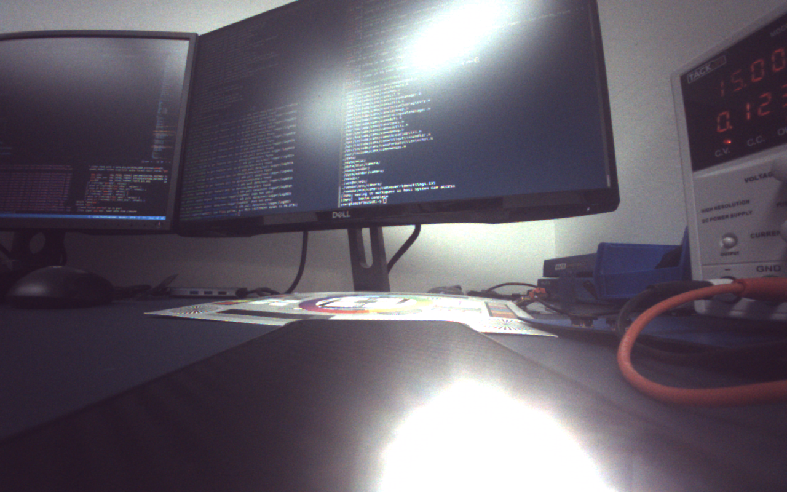

# Raw Image Pipeline
Open source repository that provides tools and algorithms that can be used for demosaicing and tuning images

In it's current state, we're only able to demosaic mipi10 opaque raw images

## Bilinear Interpolation Results
The following image shows a raw image being demosaiced


# Usage
In order to use the tool begin by downloading the git repo
```bash
git clone https://github.com/HectorENevarez/raw_image_pipeline.git
cd raw_image_pipeline
```

Next modify the configuration settings in the config_file.h
``` c++
// set config values
int width = 1280;
int height = 800;
string cfa = "null"; // not yet supported
string format = "mipi_raw"; // currently only supported format
string save_loc = "images/result.png";
string image_file = "images/test_image.raw";
```
You can keep these values as is, if you'd like to experiment with the test image, if not modify these values to fit your needs

Finally build and run the program
``` bash
./build.sh
./run.sh
```

